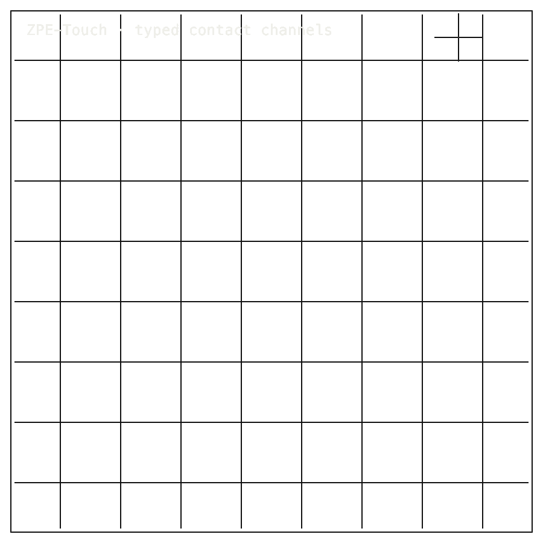

# ZPE-Touch

## Package Install

PyPI package: `zpe-touch==0.1.0` on [PyPI](https://pypi.org/project/zpe-touch/).
Current published artifacts are Python 3.11 Linux x86_64 manylinux wheels only; macOS/Windows installs and source-build installs require future sdists or additional platform wheels. Package availability does not imply product readiness.
Source: [Zer0pa/ZPE-Touch](https://github.com/Zer0pa/ZPE-Touch/).

Supported PyPI artifact install, on Python 3.11 Linux x86_64:

```bash
python3.11 -m pip install zpe-touch
```

For full install, smoke, source, and developer commands, [click here](#install-developer-commands-detailed).

---

<table width="100%">
<tr>
<td width="100%" valign="top">
<div><span><b>00 · ZPE-TOUCH</b> · TOUCH-STREAM VALIDATION</span> <span>RESEARCH-READY · V_01..V_03 PASS</span></div>
      <h1>Encoding Many <span>Dimensions of Touch</span></h1>
      <p>Four touch streams, each independently recoverable &mdash; contact, thermal, vibrotactile, proprioceptive · ZPE-Touch · PyPI <em>zpe-touch</em> 0.1.0, Linux x86_64 wheel only · github.com/Zer0pa/ZPE-Touch</p>
      <p>When you hold something, your hand reports four things at once: contact pressure, surface temperature, vibration, and where the limb sits in space. Machines have always collapsed those into a single tactile stream. ZPE-Touch gives each sense its own branch and ships them together in one packet. A contact-only decoder, applied to a thermal payload, returns <strong>0.0</strong> &mdash; the isolation is exact, not approximate. V_01, V_02, V_03 PASS on a fresh clone.</p>
</td>
</tr>
</table>

<table width="100%">
<tr>
<td width="100%" valign="top">
<figure>
        <div></div>
        <figcaption><b>Scope:</b> branch-isolated touch streams. Contact, thermal, vibrotactile, and proprioceptive branches verify separately.</figcaption>
      </figure>
</td>
</tr>
</table>

<table width="100%">
<tr>
<td width="100%" valign="top">
<div><b>01 · THE GAP</b> <span>ONE STREAM, FOUR SENSATIONS</span></div>
      <h2>Touch carries four distinct sensations at once. No research format has kept all four separately recoverable.</h2>
</td>
</tr>
</table>

<table width="100%">
<tr>
<td width="100%" valign="top">
<div><b>02 · MARKETS</b> <span>ADJACENT R&amp;D DOMAINS</span></div>
      <div>
        <div>
          <div><span>Haptics R&amp;D teams</span>  <span>best-fit</span></div>
          <div><span>Tactile-sensing labs</span>  <span>workflow</span></div>
          <div><span>Robot-skin sensing R&amp;D</span>  <span>candidate</span></div>
          <div><span>Teleoperation + embodied-interaction R&amp;D</span>  <span>research</span></div>
          <div><span>XR haptics experimenters</span>  <span>conditional</span></div>
        </div>
      </div>
      <div>Best-fit R&amp;D teams only. No TAM, procurement readiness, or broad tactile-codec adoption claimed.</div>
</td>
</tr>
</table>

<table width="100%">
<tr>
<td width="50%" valign="top">
<div><b>03 · VALUE OF MARKET</b></div>
      <div><span>R&amp;D</span> <span>scope</span></div>
      <div>Four touch senses round-trip exactly. Distribution breadth and external comparators remain open.</div>
</td>
<td width="50%" valign="top">
<div><b>04 · INSIGHT</b></div>
      <h2>Touch is not one sensation. It has always been <span>four.</span></h2>
</td>
</tr>
</table>

<table width="100%">
<tr>
<td width="50%" valign="top">
<div><b>05.1 · CURRENT TECH</b> <span>ONE STREAM, NO ISOLATION</span></div>
        <p>Today's haptic pipelines carry contact, temperature, vibration, and limb position in one undifferentiated stream. To inspect the thermal record of a grasp, a researcher must decode the whole touch event and pull the heat back out by hand.</p>
</td>
<td width="50%" valign="top">
<div><b>05.2 · OUR TECH</b> <span>FOUR BRANCHES, EACH EXACT</span></div>
        <p>ZPE-Touch gives each sense its own typed branch in the packet: contact, thermal, RA_II vibrotactile, and proprioceptive. Each branch round-trips exactly. A decoder built for contact, applied to a thermal payload, returns <strong>0.0</strong> &mdash; exactly zero, not an approximation. Same-contact alias rate sits at <strong>0.0</strong>, collision rate at <strong>0.0</strong>. The four senses do not bleed.</p>
</td>
</tr>
</table>

<table width="100%">
<tr>
<td width="100%" valign="top">
<div><b>05.3 · BENCHMARKS</b> <span>DECLARED FIXTURES</span></div>
      <div>
        <div>
          <div><span>Contact</span><b>1.0</b><small>exact rate</small></div>
          <div><span>Thermal</span><b>1.0</b><small>exact rate</small></div>
          <div><span>Vibrotactile</span><b>1.0</b><small>exact rate</small></div>
          <div><span>Proprioceptive</span><b>1.0</b><small>exact rate</small></div>
        </div>
        <div>
          <div><span>V_01 PASS</span>  <span>PASS</span></div>
          <div><span>V_02 PASS</span>  <span>PASS</span></div>
          <div><span>V_03 PASS</span>  <span>PASS</span></div>
        </div>
      </div>
      <div><b>Scope:</b> declared fixtures only. No external tactile-codec comparator. Four-branch exactness, not field claims.</div>
</td>
</tr>
</table>

<table width="100%">
<tr>
<td width="34%" valign="top">
<div><b>06 · MEASUREMENT</b> <span>BRANCH-ISOLATED VERIFICATION</span></div>
      <h2>Each branch measured separately. <span>V_01..V_03 PASS on a fresh clone.</span></h2>
</td>
<td width="66%" valign="top">
<div><b>06.1 · COMPARATIVE PERFORMANCE · BRANCH EXACT RATES</b></div>
      <div>
        <div>
          <div><span>Contact stream</span>  <span>1.0 exact</span></div>
          <div><span>Thermal stream</span>  <span>1.0 exact</span></div>
          <div><span>Vibrotactile stream</span>  <span>1.0 exact</span></div>
          <div><span>Proprioceptive stream</span>  <span>1.0 exact</span></div>
        </div>
      </div>
      <div><strong>V_01..V_03 PASS on a fresh clone.</strong> Branch-aware decoders return the exact payload for their sense; a contact-only decoder returns <strong>0.0</strong> from thermal, vibrotactile, and proprioceptive payloads. Source: <em>proofs/manifests/VERIFICATION_SUMMARY.md</em>.</div>
</td>
</tr>
</table>

<table width="100%">
<tr>
<td width="100%" valign="top">
<div><b>07 · KEY METRICS</b> <span>MEASURED RESULTS</span></div>
</td>
</tr>
</table>

<table width="100%">
<tr>
<td width="100%" valign="top">
<div><b>07.1 · CONTACT</b></div>
      <div>1.0</div>
      <div>Exact rate &middot; <b>contact branch on fresh clone</b></div>
</td>
</tr>
</table>

<table width="100%">
<tr>
<td width="100%" valign="top">
<div><b>07.2 · THERMAL</b></div>
      <div>1.0</div>
      <div>Exact rate &middot; <b>contact-only decoder returns 0.0</b></div>
</td>
</tr>
</table>

<table width="100%">
<tr>
<td width="100%" valign="top">
<div><b>07.3 · VIBROTACTILE</b></div>
      <div>1.0</div>
      <div>Exact rate &middot; <b>RA_II vibrotactile branch isolated</b></div>
</td>
</tr>
</table>

<table width="100%">
<tr>
<td width="100%" valign="top">
<div><b>07.4 · VERIFICATIONS</b></div>
      <div>3<span>/3</span></div>
      <div>V_01..V_03 PASS &middot; <b>fresh clone, Rust and Python agree</b></div>
</td>
</tr>
</table>

<table width="100%">
<tr>
<td width="100%" valign="top">
<div><b>07.5 · PROPRIOCEPTIVE</b></div>
      <div>1.0</div>
      <div>Exact rate &middot; <b>joint-angle and tension branch</b></div>
</td>
</tr>
</table>

<table width="100%">
<tr>
<td width="100%" valign="top">
<div><b>08 · BRANCH ISOLATION</b> <span>EXACT OR ZERO</span></div>
      <h2>Four streams. Four branches. Apply the wrong decoder &mdash; <span>zero recovery.</span></h2>
</td>
</tr>
</table>

<table width="100%">
<tr>
<td width="66%" valign="top">
<div><b>08.1 · WHAT BRANCH ISOLATION MEANS</b> <span>THE PROOF</span></div>
      <p>On the declared validation surface &mdash; contact, thermal, RA_II vibrotactile, proprioceptive &mdash; V_01 through V_03 PASS on a fresh clone. The native Rust backend and the Python reference path produce matching output. Branch isolation is verified end to end.</p>
      <p>A contact-only decoder, applied to a thermal payload, returns <strong>0.0</strong> &mdash; not an approximation, exactly zero. Same-contact alias rate: <strong>0.0</strong>. Collision rate: <strong>0.0</strong>. The four senses are genuinely separate. The claim holds for these declared streams on declared fixtures.</p>
</td>
<td width="34%" valign="top">
<div><b>08.2 · HONEST BLOCKER</b></div>
      <span>Honest Blocker &middot;</span>
      <p>Scope: declared fixtures. <strong>PyPI zpe-touch 0.1.0</strong> ships one Python 3.11 Linux x86_64 manylinux wheel &mdash; no source distribution, no macOS, no Windows. API hardening and external benchmarks remain open. Compass-8 stays outside scope. No affective touch, no full embodied touch, no ambient thermal modeling.</p>
</td>
</tr>
</table>

<table width="100%">
<tr>
<td width="33%" valign="top">
<div><b>09</b> </div>
      <h2>TOUCH WITH <span>FOUR HONEST CHANNELS.</span></h2>
</td>
<td width="67%" valign="top">
<div><b>09.1 · THE AMBITION</b></div>
      <p>The aim is a tactile packet built from four typed senses: contact as the base, with thermal, RA_II vibrotactile, and proprioceptive histories carried alongside it and each one recoverable on its own. Getting there means closing API hardening, broader distribution, and external comparators across haptic systems that do not share a stack.</p>
</td>
</tr>
</table>

<table width="100%">
<tr>
<td width="33%" valign="top">
<div><b>09.2 · WHAT WORKS NOW</b></div>
        <h2>Working today: four sense-isolated branches, each round-tripping exactly, on declared validation fixtures.</h2>
</td>
<td width="67%" valign="top">
<div><b>09.3 · WHAT'S STILL OPEN</b></div>
        <h2>Still open: API hardening, broader distribution, external comparators, affective and ambient-thermal touch.</h2>
</td>
</tr>
</table>

<table width="100%">
<tr>
<td width="100%" valign="top">
<div><b>09.4</b> &middot; LAB FORMAT · NEAR-TERM (12–24 MO)</div>
      <div>A shared file for tactile sessions</div><div>A haptics lab can hand off a session knowing the receiver sees contact, temperature, vibration, and limb position as four separate things. Reviewers pull the thermal record from one experiment without re-decoding the rest of the touch event.</div>
</td>
</tr>
</table>

<table width="100%">
<tr>
<td width="100%" valign="top">
<div><b>09.5</b> &middot; XR TRANSPORT · NEAR-TERM (12–24 MO)</div>
      <div>XR sessions carry touch as four senses</div><div>An XR or teleoperation session transmits all four touch dimensions together, but a downstream tool can read just the vibration channel or just the joint trace. Design teams compare what a controller did to what a hand actually felt, side by side.</div>
</td>
</tr>
</table>

<table width="100%">
<tr>
<td width="100%" valign="top">
<div><b>09.6</b> &middot; ROBOT SKIN · MID-TERM (24–48 MO)</div>
      <div>Robot-skin archives split by sense</div><div>A robotics group recording tactile sensor arrays keeps contact pressure, surface temperature, micro-vibration, and joint state as four indexable signals. A later study queries only the thermal record from a grasp without re-processing the rest of the session.</div>
</td>
</tr>
</table>

<table width="100%">
<tr>
<td width="100%" valign="top">
<div><b>09.7</b> &middot; TELEOPERATION · MID-TERM (24–48 MO)</div>
      <div>Remote touch sessions stay reviewable</div><div>Surgeons, undersea operators, and remote-arm pilots end a session with a recording where each tactile sense is its own track. A second clinician or a regulator inspects the vibration channel of one moment without replaying the full embodied feed.</div>
</td>
</tr>
</table>

<table width="100%">
<tr>
<td width="100%" valign="top">
<div><b>09.8</b> &middot; TOUCH AS DATA · PARADIGM (48 MO+)</div>
      <div>Touch becomes a thing you store</div><div>For the first time, a touch event lives as four parallel records you can open later &mdash; pressure here, heat there, vibration alongside, limb posture beside that. Touch enters the same regime as text, audio, and motion: storable, addressable, inspectable years after the hand moved on.</div>
</td>
</tr>
</table>

---

<a id="install-developer-commands-detailed"></a>

## Install / Developer Commands Detailed

<!-- INSTALL-DX:START -->
#### Package Install

PyPI package: `zpe-touch==0.1.0` on [PyPI](https://pypi.org/project/zpe-touch/).
Current published artifacts are Python 3.11 Linux x86_64 manylinux wheels only; macOS/Windows installs and source-build installs require future sdists or additional platform wheels. Package availability does not imply product readiness.
Source: [Zer0pa/ZPE-Touch](https://github.com/Zer0pa/ZPE-Touch/).

Supported PyPI artifact install, on Python 3.11 Linux x86_64:

```bash
python3.11 -m pip install zpe-touch
```

Import smoke after a supported-platform install:

```bash
python3.11 - <<'PY'
import importlib.metadata as md
import zpe_touch

print("zpe-touch", md.version("zpe-touch"))
PY
```

Install success only proves package acquisition/import. Product scope, stale PyPI state, platform limits, and blockers remain in the front-door sections below.
- Current PyPI surface is Linux x86_64 Python 3.11 wheel-only with no sdist; use Python 3.11 Linux x86_64 for PyPI smoke checks.
<!-- INSTALL-DX:END -->

#### Quick Start

```bash
cargo --version
python3 -m venv .venv
. .venv/bin/activate
python -m pip install --upgrade pip
python -m pip install . build pytest
python -m pytest tests/test_touch_pack_regression.py tests/test_touch_native_optional.py tests/test_touch_fiber_branches.py -q
python scripts/generate_public_touch_artifacts.py
python -m build
```
